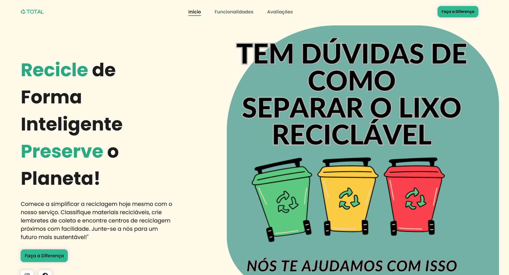

# Landing Page - Sistema de Reciclagem Sustentável

Landing page moderna e responsiva para um sistema de reciclagem sustentável, focado em facilitar a vida dos usuários na classificação correta de materiais, criação de lembretes para coleta e localização de centros de reciclagem próximos.
Desenvolvida para a projeto da materia de UPX2 da FACENS

---

## Descrição

Esta landing page apresenta um serviço que ajuda os usuários a reciclar de forma inteligente, promovendo a preservação do meio ambiente. Com uma interface intuitiva e visual atrativo, o site destaca as principais funcionalidades do sistema, exibe avaliações dos usuários e incentiva a participação na reciclagem.

---

## Funcionalidades principais

- **Classificação de materiais:** Pesquise materiais recicláveis e saiba como descartá-los corretamente.
- **Lembretes de coleta:** Crie alertas para não esquecer os dias e horários de coleta seletiva.
- **Localização de centros:** Encontre centros de reciclagem próximos e conecte-se facilmente.
- **Layout responsivo:** Design adaptado para diferentes dispositivos, incluindo mobile.
- **Navegação amigável:** Menu fixo, com destaque para a seção ativa durante a rolagem da página.
- **Animações com ScrollReveal:** Conteúdo animado para melhor engajamento visual.

---

## Tecnologias utilizadas

- HTML5
- CSS3 (Flexbox, Responsividade)
- JavaScript (jQuery para manipulação DOM e efeitos)
- ScrollReveal.js para animações de entrada
- Font Awesome para ícones

---

## Como usar

1. Clone ou baixe o repositório.
2. Execute localmente abrindo o arquivo `index.html` (ou equivalente).
3. Explore as funcionalidades da landing page e navegue pelas seções.
4. Para testar no desenvolvimento, utilize um servidor local para resolver rotas relativas (ex: Live Server no VSCode).

---

## Demonstração

Acesse a landing page em: [Landing Page Reciclagem Sustentável](https://landing-page-upx.vercel.app/)

---